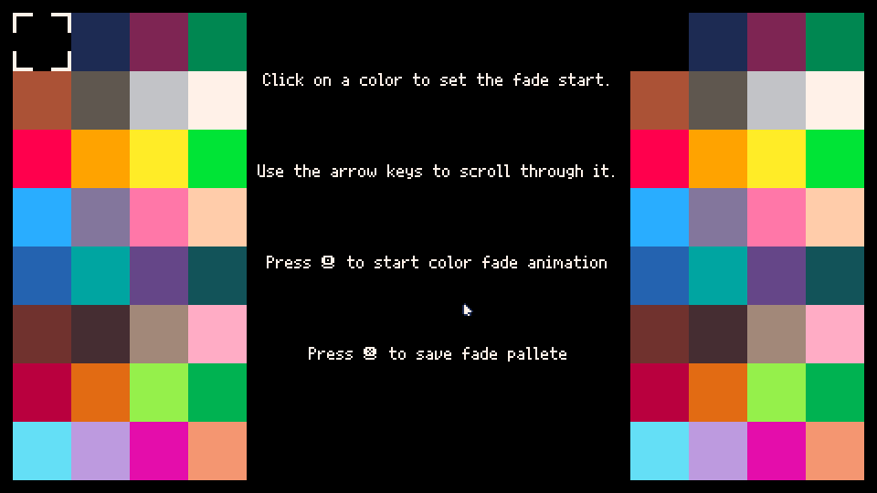

# PaletteFade

A visual color fade generator for **Picotron's default palette**.

PaletteFade is a development tool that simplifies the creation of smooth palette transitions by generating optimized fade tables between Picotron's built-in colors. Instead of manually defining color mappings, developers can visually design, preview, and export fade palettes for use in their own projects.

---

## Features

- 🎨 Generate smooth color fade tables using Picotron's default palette.
- 👀 Real-time preview of fade transitions.
- ⚡ Adjustable animation speed and playback direction.
- 🖱️ Simple and intuitive graphical interface.
- 📋 Export generated fade tables directly into your Picotron projects.
- 🎮 Designed specifically for game development and retro-style graphics.

---

## Why PaletteFade?

Creating convincing palette fades by hand can be tedious and error-prone. PaletteFade provides an interactive workflow that lets developers experiment with different transitions and immediately visualize the results before integrating them into their games.

Whether you're creating:

- Screen fade-in / fade-out effects
- Damage flashes
- Lighting transitions
- Day & night cycles
- UI animations
- Retro visual effects

PaletteFade helps speed up development while producing consistent results.

---

## Built For

- Picotron
- Lua
- Retro game development
- Palette-based rendering

---

## How It Works

1. Select the source and target palette colors.
2. Configure the fade parameters.
3. Preview the animation in real time.
4. Export the generated fade table.
5. Use the generated data directly inside your Picotron project.

---

## Installation

Clone the repository:

```bash
git clone https://github.com/Fecox/PaletteFade.git
```

Or download the latest release from itch.io.

---

## Screenshots

<p align="center">
  
</p>

---

## Download

You can download the latest version on itch.io:

**https://bitware-interactive.itch.io/palettefade-tool**

---

## Motivation

PaletteFade was created to simplify one of the repetitive tasks when developing games for Picotron. By providing a visual editor instead of requiring manual palette mapping, it allows developers to iterate faster and focus on creating gameplay rather than writing utility code.

---

## License

This project is released under the MIT License.
